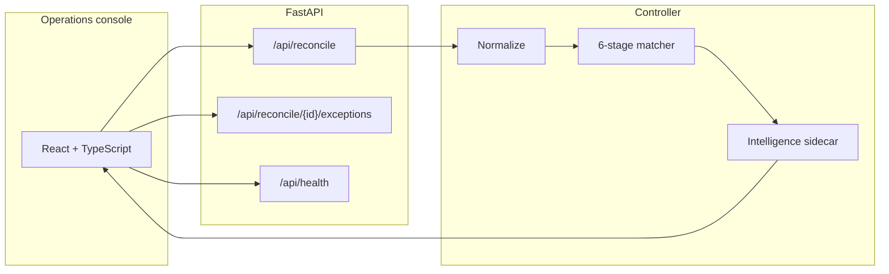

# BookParity

### AI Finance Controller — Reconciliation Operations Console

Razorpay AI Buildathon 2026 · Track 04 — AI Finance Controller

BookParity takes a bank-statement extract and a merchant ledger, then runs a deterministic reconciliation engine that pairs the two books and classifies every leftover as a typed exception. Each decision ships with a reconstructable reason and the similarity evidence a reviewer needs. AI can categorize text and rank the review queue; it never sets, rewrites, or overrides the financial control.

> **AI assists the reviewer; deterministic logic controls the reconciliation.**

---

### At a glance

| Live / demo workload | Frozen offline evaluation |
| --- | --- |
| **4,041** source records (2,116 bank + 1,925 ledger) | **2,000** labeled cases — scoring only, never loaded at runtime |
| **~46,600** records/sec (~0.087s on the 4,041-row batch) | **94.85%** accuracy · **82.17%** Macro F1 · **100%** MATCH recall · **98.52%** AMBIGUOUS F1 |

The 4,041-row figure is the source workload the engine processes. The 2,000-case figure is a separate labeled holdout used only to score the engine. They are not the same set.

**Navigate:** [Quick Start](#quick-start) · [How it works](#how-it-works) · [Results](#measured-results) · [Architecture](#architecture) · [API](#api) · [Tests](#tests) · [Design decisions](#design-decisions-worth-reading)

---

## Why BookParity?

Bank rows and ledger rows rarely line up as exact strings. Indian payment text is hostile: UPI/POS prefixes, merchant aliases, city codes, truncated references, one-digit-off IDs, and fee-deducted amounts. Exact-match ERP rules miss the fuzzy majority. A black-box LLM that “just matches” is not an auditable control — finance needs a reason it can reconstruct.

Wrong exception type is as expensive as a missed match. A fee deduction is billing. A fuzzy reference is identity. A second submission of the same payout is a duplicate. Those are different desks.

**BookParity is the reconciliation control, not a chatbot.**

---

## What we built

1. Deterministic 6-stage reconciliation engine
2. Explainable exception classification
3. Supporting intelligence sidecar
4. FastAPI service
5. React / TypeScript operations console
6. Frozen offline evaluation suite

```
Bank CSV  +  Ledger CSV
        ↓
Deterministic 6-stage reconciliation engine
        ↓
MATCH / AMOUNT_MISMATCH / DUPLICATE / AMBIGUOUS
UNMATCHED_BANK / UNMATCHED_LEDGER
        ↓
Intelligence sidecar
(category + priority + optional anomaly)
        ↓
React operations console
```

ML/LLM signals support review. They do not determine reconciliation status.

The console has three pages — **Reconcile**, **Exceptions**, **Transactions**. It displays backend results only: no invented KPIs, no rewritten audit reasons, no chat.

<!--
  SCREENSHOTS — none are in this repository yet. Do not add empty image links.
  After capturing real UI, insert them here in this order:
    1. Reconcile dashboard / main console
    2. Exception detail (bank vs ledger + deterministic reason)
    3. Transactions view
-->

---

## Measured results

**Frozen offline evaluation.** Ground truth (`data/reconciliation/reconciliation_ground_truth.csv`) is used only for scoring. It is never loaded during live or demo reconciliation.

Phase 2.5 is the current engine. Day 2 is the frozen baseline it was measured against.

| Metric | Day 2 | Phase 2.5 |
| --- | --- | --- |
| Overall accuracy | 89.30% | **94.85%** |
| Macro F1 | 62.10% | **82.17%** |
| Weighted F1 | 85.13% | **92.44%** |
| MATCH recall | 99.71% | **100%** (1,400 / 1,400) |
| AMOUNT_MISMATCH F1 | 83.33% | **100%** |
| AMBIGUOUS F1 | 0% | **98.52%** |
| Throughput | — | **~46,600 records/sec** |

Runtime on the 4,041-record source batch: **~0.087 seconds** (`processing_time_seconds` = 0.086636).

Artifacts: [`evaluation/phase2_5_reconciliation_metrics.json`](ai-finance-controller/evaluation/phase2_5_reconciliation_metrics.json) · [`phase2_5_design_notes.md`](ai-finance-controller/evaluation/phase2_5_design_notes.md) · [`phase2_5_error_analysis.json`](ai-finance-controller/evaluation/phase2_5_error_analysis.json)

---

## What we refused to fake

A naive categorization train/test split scored **1.0000**. That score is not robustness. Investigation showed **43%** of test descriptions (1,291 / 3,000) already appeared in training. A description-grouped split still looked perfect because held-out text reused category-specific merchant tokens.

A frozen **324-row challenge set** — never used to train or tune — is the honest number:

| Group | Local ML accuracy |
| --- | --- |
| Known merchant, noisy bank-style text | 63.9% |
| Unseen merchant | 11.1% |
| Ambiguous / generic payment text | 9.3% |

Those weaker numbers are why Gemini is a **confidence-gated fallback** (local confidence &lt; 0.70), not a claim that local ML generalizes. This README does not lead with “AI accuracy.”

**Duplicate metric vs source-level books.** 100 ground-truth cases key the *primary* bank id as `DUPLICATE`. The engine MATCHES the settled invoice and emits the companion as `DUPLICATE` with `duplicate_of_bank_txn_id`. We document that 100-case scoring gap instead of corrupting the books to chase a headline. See `phase2_5_error_analysis.json`.

---

## 5-minute evaluation path

1. Start the backend, then the frontend ([Quick Start](#quick-start)).
2. Confirm the header shows **Backend ok**.
3. On **Reconcile**, click **Run Demo Reconciliation** (bundled 2,116 + 1,925 rows; same pipeline as upload; no ground truth).
4. Read match rate, exception count, status mix, runtime, and throughput from the run summary.
5. Open **Exceptions**, filter **HIGH**, open a row.
6. Compare bank vs ledger. Read the engine’s reason string and similarity signals. The UI does not rewrite the reason.
7. Open **Transactions** and walk the full result set.
8. Compare the live run with the frozen artifacts under `ai-finance-controller/evaluation/`.

---

## Quick start

### Requirements

- Python 3.10+
- Node.js 20+

Gemini is **not** required. The local categorization model is the default path. Leave `GEMINI_API_KEY` unset.

Never commit `.env` files or API keys. The Gemini client reads the key from the process environment only.

### Terminal 1 — Backend

```bash
cd ai-finance-controller
python -m venv .venv
source .venv/bin/activate          # Windows: .venv\Scripts\activate
pip install -r requirements.txt
uvicorn src.api.main:app --reload --host 127.0.0.1 --port 8000
```

- API docs: [http://127.0.0.1:8000/docs](http://127.0.0.1:8000/docs)
- Health: [http://127.0.0.1:8000/api/health](http://127.0.0.1:8000/api/health)

### Terminal 2 — Frontend

```bash
cd frontend/finance-flow-monitor-main
npm install
echo 'VITE_API_BASE_URL=http://127.0.0.1:8000' > .env
npm run dev
```

`.env` is local-only. Do not commit it.

Open the URL printed by Vite. Default CORS allows `localhost` ports `3000`, `5500`, `8000`, and `8080`. If Vite picks another port:

```bash
CORS_ORIGINS=http://localhost:<your-port> uvicorn src.api.main:app --reload --host 127.0.0.1 --port 8000
```

Runs live in memory (last 50). Restarting the API clears them.

---

## How it works

Every output row has a **status**, **match method**, **confidence**, and a **human-readable reason**. Normalization is deterministic (merchant aliases such as `SWIGGY*BLR` → `SWIGGY`, UPI/POS reference cleaning). Implementation: `ai-finance-controller/src/reconciliation/`.

The engine never sees ground truth.

### Decision statuses

| Status | Meaning |
| --- | --- |
| `MATCH` | Bank and ledger are the same economic event |
| `AMOUNT_MISMATCH` | Same invoice identity (exact reference); rupee amount differs — fee, tax, partial |
| `DUPLICATE` | Second bank submission of an already-settled invoice |
| `AMBIGUOUS` | Plausible candidates exist; identity is not unique |
| `UNMATCHED_BANK` | Money moved; no ledger row |
| `UNMATCHED_LEDGER` | Invoice exists; no settlement |

**`AMOUNT_MISMATCH` vs `AMBIGUOUS`:** amount-mismatch means the reference is an exact verified match and only the money is wrong. If the reference is also fuzzy, identity is not proven → `AMBIGUOUS`. That is a control distinction, not a scoring trick. It reclassified 100 cases in Phase 2.5.

### Six-stage pipeline

1. **Duplicate detection** — same normalized reference, direction, amount (± ₹0.01), within 48 hours
2. **Exact match** — same reference, amount, direction, within 7 days
3. **Amount mismatch** — exact reference + direction; amount differs
4. **Duplicate linkage** — primary stays `MATCH` with `has_duplicate_submission`; companion is `DUPLICATE` with `duplicate_of_bank_txn_id`
5. **Gated fuzzy match** — multi-signal score; high-confidence `MATCH` or `AMBIGUOUS`
6. **Unmatched** — leftover bank and leftover ledger, separately

### Scoring and evidence gate

Weights sum to 1.0:

| Signal | Weight |
| --- | --- |
| Reference similarity | 40% |
| Amount similarity | 30% |
| Merchant similarity | 20% |
| Timestamp proximity | 10% |

- High-confidence match ≥ **0.85**
- Ambiguity band ≥ **0.70**, with a **0.05** margin between top candidates

A pair is not a candidate on merchant name alone. Generic tokens (`SWIGGY`, `AMAZON`) appear on unrelated rows. The evidence gate requires:

- reference similarity ≥ **0.75**, **or**
- amount similarity ≥ **0.95** **and** merchant similarity ≥ **0.80**

---

## Supporting intelligence

Post-reconciliation only. The sidecar cannot change `predicted_status`, match confidence, or `match_method`.

| Signal | Implementation | Honesty rule |
| --- | --- | --- |
| **Category** | TF-IDF + logistic regression on transaction text | Local model first. Gemini only if confidence &lt; 0.70 |
| **Priority** | Transparent rules | `DUPLICATE` → HIGH; unmatched ≥ ₹5,000 → HIGH; amount diff ≥ ₹1,000 → HIGH; `MATCH` → LOW |
| **Anomaly** | Isolation Forest | Requires customer-history features. Reconciliation CSVs do not have them → `anomaly_status = unavailable`. No fabricated score. |

The intelligence sidecar is post-reconciliation and cannot change the financial decision.

Gemini (`gemini-3.5-flash-lite` in `src/llm/gemini_fallback.py`) is optional: structured JSON, category allow-list, retries on 429/5xx, redacted errors. Setup is at the bottom of this README.

---

## Architecture



| Layer | Path | Role |
| --- | --- | --- |
| Engine | `ai-finance-controller/src/reconciliation/` | Matching, statuses, reasons |
| Intelligence | `ai-finance-controller/src/intelligence/` | Category, priority, optional anomaly |
| LLM fallback | `ai-finance-controller/src/llm/` | Confidence-gated Gemini |
| API | `ai-finance-controller/src/api/` | CSV ingest, in-memory runs, pagination |
| Console | `frontend/finance-flow-monitor-main/` | Reconcile / Exceptions / Transactions |

No cloud deploy, database, or queue is part of this repository. The API process holds runs in memory.

---

## API

| Method | Endpoint | Purpose |
| --- | --- | --- |
| `GET` | `/api/health` | API and model availability |
| `POST` | `/api/reconcile/demo` | Bundled synthetic batch (ground truth not loaded) |
| `POST` | `/api/reconcile` | Multipart: `bank_file`, `ledger_file` |
| `GET` | `/api/reconcile/{run_id}` | Full run |
| `GET` | `/api/reconcile/{run_id}/exceptions` | Filters: `status`, `priority`, `search`, `limit`, `offset` |
| `GET` | `/api/reconcile/{run_id}/exceptions/{id}` | Bank + ledger payloads and audit fields |
| `GET` | `/api/benchmark` | Frozen offline metrics (evaluation artifact only) |

Interactive docs while the backend is running: [`/docs`](http://127.0.0.1:8000/docs) · [`/redoc`](http://127.0.0.1:8000/redoc)

---

## CSV contract

Bundled demo files: `ai-finance-controller/data/reconciliation/`.

**Bank** — required: `bank_txn_id`, `timestamp`, `amount`, `direction`, `merchant`, `reference`. Optional: `payment_method` (defaults to `UNKNOWN`).

**Ledger** — required: `ledger_id`, `timestamp`, `amount`, `direction`, `merchant`, `reference`. Optional: `invoice_id`.

`direction` is `CREDIT` or `DEBIT`.

---

## Tests

```bash
cd ai-finance-controller
source .venv/bin/activate
pytest -q --basetemp=.pytest_tmp
```

Covered: engine stages; Phase 2.5 regressions (ambiguity ordering, duplicate window, evidence gate); hybrid categorization; intelligence priority; API validation; Phase 2 diagnostics.

Tests use isolated fixtures. They do not use ground truth to drive reconciliation decisions.

---

## Repository layout

```
ai-finance-controller/
  src/reconciliation/     Deterministic matcher
  src/intelligence/       Category / priority / anomaly sidecar
  src/categorization/     TF-IDF pipeline + challenge / hybrid eval
  src/anomaly/            Isolation Forest (optional)
  src/llm/                Gemini fallback
  src/api/                HTTP surface
  data/reconciliation/    Demo bank + ledger; ground truth for scoring only
  data/raw/               Categorization training extract
  evaluation/             Frozen metrics, matrices, error analysis
  tests/
frontend/
  finance-flow-monitor-main/   React operations console
```

---

## Design decisions worth reading

1. **Verification over generation.** The engine is the product. The LLM is a gated fallback for novel text, not the matcher.
2. **Exception type is a control, not a label.** Ambiguity before amount-mismatch when the reference is fuzzy. That change reclassified 100 cases and lifted Macro F1 by ~20 points.
3. **Source-level duplicate fidelity.** An invoice can be settled *and* a second submission can exist. Both facts are recorded.
4. **No invented risk.** Missing customer-history features → `anomaly_status = unavailable`.
5. **Frontend never lies.** Empty states, CSV errors, backend-unreachable copy. Live runs are never mixed with mock numbers.

---

## Optional development

### Retrain categorization

If `ai-finance-controller/models/categorization_pipeline.joblib` is missing, reconciliation still runs; category fields degrade to unknown / unavailable.

```bash
cd ai-finance-controller
python -m src.categorization.train \
  --data data/raw/transactions_v2.csv \
  --model models/categorization_pipeline.joblib \
  --evaluation-output evaluation/phase1_metrics.json
```

### Gemini (optional)

Not required for the demo. Local TF-IDF remains the default. Gemini is attempted only when local confidence is below 0.70.

```bash
export GEMINI_API_KEY=          # set locally; never commit
```

Never commit `GEMINI_API_KEY` or `.env` files. The key is read from the environment only.

---

## License

Built for the Razorpay AI Buildathon 2026 (Track 04). Use and extend as needed for evaluation and interview.
